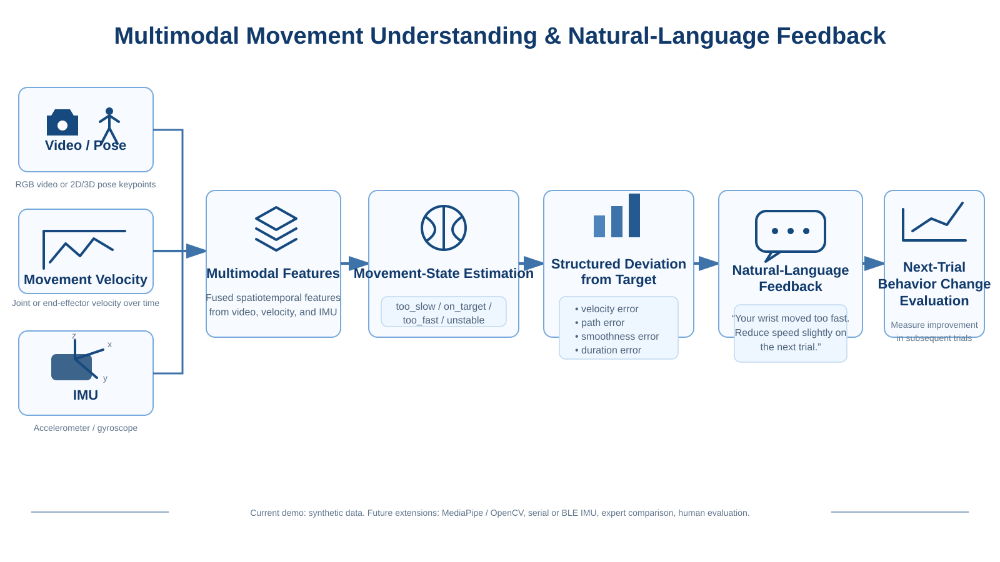

# Multimodal Movement Understanding & Natural-Language Feedback

<p align="center">
  
</p>

Flow:

video / pose + movement velocity + IMU
→ movement-state estimation
→ structured deviation from target
→ natural-language feedback
→ next-trial behavior-change evaluation

This repository is a compact research prototype for human-centered AI.
The default demo uses synthetic multimodal trials so that the full pipeline can run without hardware.

## What it demonstrates

- multimodal movement features
- AI-based movement-state estimation
- structured target-deviation analysis
- natural-language feedback generation
- trial-to-trial behavior-change evaluation

## Current demo

The synthetic example classifies movement states such as:

- `too_slow`
- `on_target`
- `too_fast`
- `unstable`

It then converts speed, trajectory, and smoothness deviations into human-readable feedback.

## Run

```bash
pip install -r requirements.txt
python main.py
```

## Planned extensions

1. Replace synthetic video features with MediaPipe/OpenCV wrist tracking.
2. Add real IMU input through serial or BLE.
3. Fuse camera and IMU measurements.
4. Compare generated feedback with expert ratings.
5. Evaluate whether feedback changes next-trial behavior.

## Research direction

This project explores how multimodal human-sensing data can be converted into interpretable movement-state estimates and actionable feedback.
